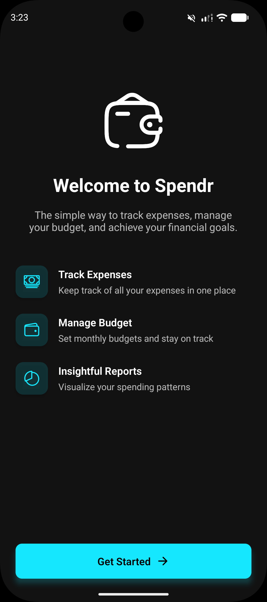
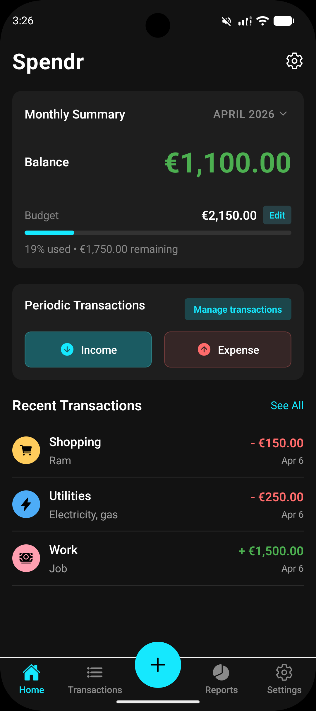
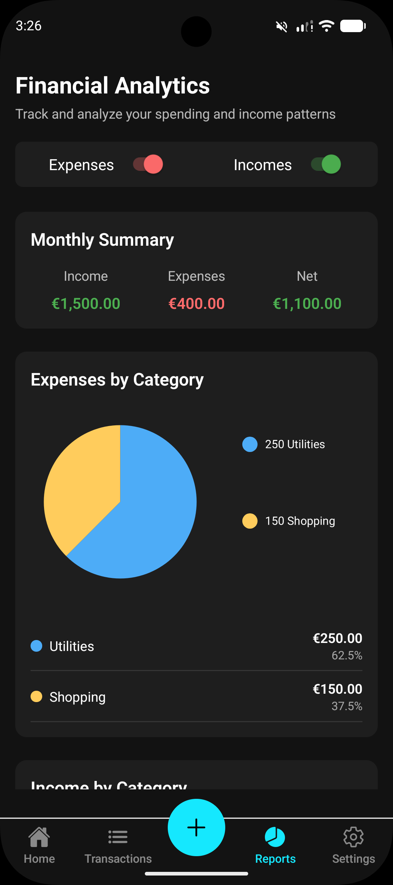
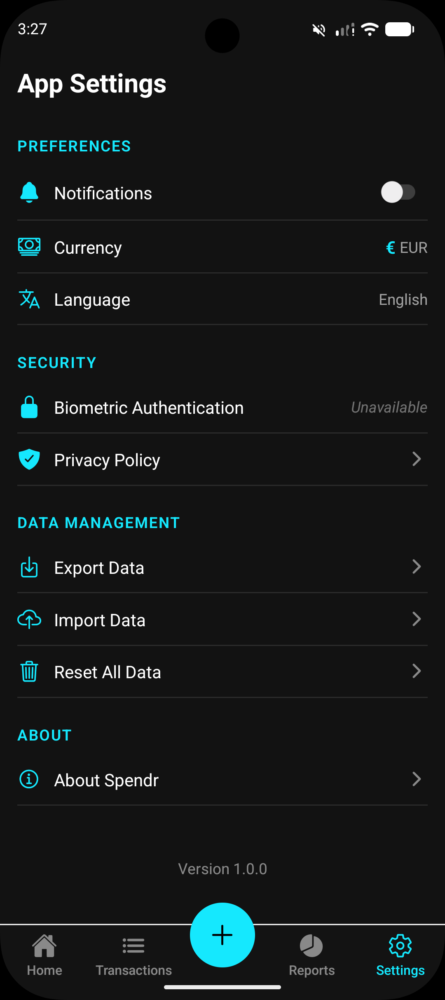

# Spendr
<p align="center">
  
</p>
<p align="center">
  <b>A comprehensive personal finance tracker built with React Native & Expo</b>
</p>

## 📱 Overview
Spendr is a feature-rich expense tracking app that helps you manage your finances with ease. Track expenses, set budgets, monitor recurring transactions, and visualize your spending patterns - all in one beautiful, intuitive interface.

Built during the 24-hour hack.bs hackathon using React Native and Expo, Spendr combines powerful functionality with a sleek, modern design.

## ✨ Features
- **Expense & Income Tracking**: Record and categorize your daily expenses and income
- **Budget Management**: Set monthly budgets and monitor your spending
- **Recurring Transactions**: Set up automatic recurring expenses and income
- **Data Visualization**: Understand your spending habits with intuitive charts and graphs
- **Multiple Currencies**: Support for various currencies including Bitcoin, USD, EUR, GBP, and more
- **Data Import/Export**: Backup your data or transfer it between devices
- **Biometric Security**: Protect your financial data with biometric authentication
- **Dark Mode**: Easy on the eyes, perfect for night-time use
- **Customizable Categories**: Create and customize expense categories

## 🛠 Technologies Used
- **React Native**: For cross-platform mobile development
- **Expo**: To streamline development workflow
- **SQLite**: For local data storage
- **Context API**: For state management
- **Recharts**: For data visualization
- **Expo LocalAuthentication**: For biometric security
- **Expo Notifications**: For transaction reminders

## 📸 Screenshots
<div align="center" style="display: flex; flex-wrap: wrap; gap: 10px; justify-content: center; margin: 20px 0;">
  
  
  
  
</div>

## 📋 Getting Started
### Prerequisites
- Node.js (>= 14.0.0)
- npm or yarn
- Expo CLI

### Installation
```bash
# Clone the repository
git clone https://github.com/okazakee/spendr.git
cd spendr

# Install dependencies
npm install

# Start the development server
npx expo start
```

### Running on a Device
- iOS: Scan the QR code in the Expo Go app
- Android: Scan the QR code in the Expo Go app or use an emulator

## 🏗 Project Structure
```
app/
├── (tabs)/           # Tab-based navigation components
├── components/       # Reusable UI components
├── contexts/         # React Context providers for state management
├── database/         # SQLite database setup and operations
├── hooks/            # Custom React hooks
├── onboarding/       # Onboarding screens and flows
├── screens/          # Main application screens
├── transaction/      # Transaction detail and edit screens
├── utils/            # Utility functions and helpers
└── _layout.tsx       # Root layout component
```

## 📊 Core Features Explained
### Transaction Management
Track both expenses and income with detailed categorization. Each transaction includes:
- Amount
- Category
- Date
- Optional notes
- Transaction type (income/expense)

### Budget System
Set monthly budgets and track progress throughout the month with visual indicators.

### Recurring Transactions
Schedule recurring expenses or income with various recurrence patterns:
- Weekly (specific day of the week)
- Monthly (specific day of the month)
- Yearly (specific day of a specific month)

### Reports and Analytics
Visualize your financial data with:
- Pie charts for category breakdown
- Line charts for monthly trends
- Detailed category spending analysis

### Data Backup
Export your financial data as:
- CSV files for easy analysis in spreadsheet software
- Full database backups for safekeeping

## 🤝 Contributing
Contributions are welcome! Please feel free to submit a Pull Request.

---
<p align="center">
  Made with ❤️ during the <a href="https://hack.bs.it/">HACK.BS</a> 24-hour hackathon
</p>